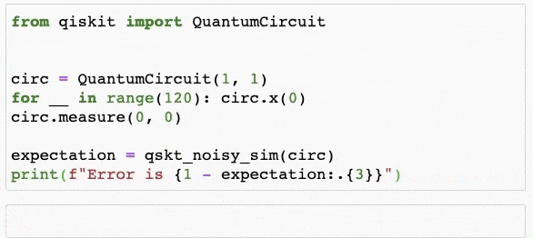

# Mitiq
[](https://github.com/unitaryfund/mitiq/actions)
[](https://codecov.io/gh/unitaryfund/mitiq)
[](https://mitiq.readthedocs.io/en/stable/)
[](https://badge.fury.io/py/mitiq)
[](https://arxiv.org/abs/2009.04417)
[](https://pepy.tech/project/mitiq)
[](https://github.com/unitaryfund/mitiq)


[](http://unitary.fund)


Mitiq is a Python toolkit for implementing error mitigation techniques on
quantum computers.

Current quantum computers are noisy due to interactions with the environment,
imperfect gate applications, state preparation and measurement errors, etc.
Error mitigation seeks to reduce these effects at the software level by
compiling quantum programs in clever ways.

Want to know more? Check out our
[documentation](https://mitiq.readthedocs.io/en/stable/guide/guide-overview.html).

## Installation

Mitiq can be installed from PyPi via

```bash
pip install mitiq
```

To build from source, see these [installation
instructions](https://mitiq.readthedocs.io/en/latest/contributing.html#development-install). To test installation, run

```python
import mitiq
mitiq.about()
```

This prints out version information about core requirements and optional
quantum software packages which Mitiq can interface with.

If you would like to contribute to Mitiq, check out the [contribution
guidelines](https://mitiq.readthedocs.io/en/stable/toc_contributing.html) for
more information.

### Supported quantum programming libraries

Mitiq can currently interface with:

* [Cirq](https://quantumai.google/cirq),
* [Qiskit](https://qiskit.org/),
* [pyQuil](https://github.com/rigetti/pyquil),
* [Braket](https://github.com/aws/amazon-braket-sdk-python).

Cirq is a core requirement of Mitiq and is automatically installed. To use
Mitiq with other quantum programming libraries, install the optional package(s)
following the instructions linked above.

### Supported quantum processors

Mitiq can be used on any quantum processor which can be accessed by supported
quantum programming libraries and is available to the user.

## Getting started

See the [getting
started](https://mitiq.readthedocs.io/en/stable/guide/guide-getting-started.html)
guide in [Mitiq's documentation](https://mitiq.readthedocs.io) for a complete
walkthrough of how to use Mitiq. For a quick preview, check out the following
snippet:

```python
import numpy as np
from cirq import depolarize, Circuit, DensityMatrixSimulator, LineQubit, X
from mitiq.zne import execute_with_zne

def noisy_simulation(circ: Circuit) -> float:
    """Simulates a circuit with depolarizing noise.

    Args:
        circ: The quantum program as a Cirq Circuit.

    Returns:
        The expectation value of the |0><0| observable.
    """
    circuit = circ.with_noise(depolarize(p=0.001))
    rho = DensityMatrixSimulator().simulate(circuit).final_density_matrix
    return np.real(np.trace(rho @ np.diag([1, 0])))

# simple circuit that should compose to the identity when noiseless
circ = Circuit(X(LineQubit(0)) for _ in range(80))

# run the circuit using a density matrix simulator with depolarizing noise
unmitigated = noisy_simulation(circ)
print(f"Error in simulation (w/o  mitigation): {1.0 - unmitigated:.{3}}")

# run again, but using mitiq's zero-noise extrapolation to mitigate errors
mitigated = execute_with_zne(circ, noisy_simulation)
print(f"Error in simulation (with mitigation): {1.0 - mitigated:.{3}}")
```
Sample output:
```
Error in simulation (w/o  mitigation): 0.0506
Error in simulation (with mitigation): 0.000519
```

### Example with Qiskit




### Example with Cirq


## Error mitigation techniques

Mitiq currently implements:

* [Zero-Noise Extrapolation](https://mitiq.readthedocs.io/en/stable/guide/guide-zne.html),
* [Probabilistic Error Cancellation](https://mitiq.readthedocs.io/en/stable/guide/guide-getting-started.html#error-mitigation-with-probabilistic-error-cancellation),
* [(Variable noise) Clifford data regression](https://mitiq.readthedocs.io/en/stable/examples/cdr_api.html),

and is designed to support [additional techniques](https://github.com/unitaryfund/mitiq/wiki).

## Documentation

Mitiq's documentation is hosted at [mitiq.readthedocs.io](https://mitiq.readthedocs.io).

## Developer information

We welcome contributions to Mitiq including bug fixes, feature requests, etc.
Please see the [contribution
guidelines](https://mitiq.readthedocs.io/en/stable/toc_contributing.html) for
more details. To contribute to the documentation, please see these
[documentation
guidelines](https://mitiq.readthedocs.io/en/stable/contributing_docs.html).

## Authors

An up-to-date list of authors can be found
[here](https://github.com/unitaryfund/mitiq/graphs/contributors).

## Research

We look forward to adding new features to Mitiq. If you have a proposal
for implementing a new quantum error mitigation technique, or adding an example
used in your research, please read our
[guidelines](https://mitiq.readthedocs.io/en/stable/research.html) for
contributing.

### Citing Mitiq

If you use Mitiq in your research, please reference the [Mitiq preprint][arxiv]
as follows:

```bibtex
@misc{larose2020mitiq,
    title={Mitiq: A software package for error mitigation on noisy quantum computers},
    author={Ryan LaRose and Andrea Mari and Peter J. Karalekas
            and Nathan Shammah and William J. Zeng},
    year={2020},
    eprint={2009.04417},
    archivePrefix={arXiv},
    primaryClass={quant-ph}
}
```

A list of papers citing Mitiq can be found [here][papers_with_mitiq].

[arxiv]: https://arxiv.org/abs/2009.04417

[papers_with_mitiq]: https://mitiq.readthedocs.io/en/stable/research.html#papers-citing-or-using-mitiq

## License

[GNU GPL v.3.0.](https://github.com/unitaryfund/mitiq/blob/master/LICENSE)

### unitaryHACK

Mitiq is participating in [unitaryHACK](http://hack2021.unitary.fund/), check
out and contribute on open issues labeled
[`unitaryhack`](https://github.com/unitaryfund/mitiq/labels/unitaryhack)!
