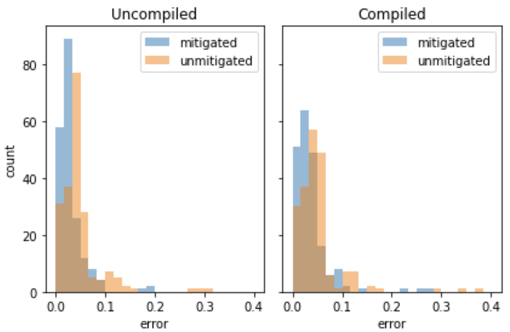

---
jupytext:
  text_representation:
    extension: .myst.md
    format_name: myst
    format_version: 0.13
    jupytext_version: 1.14.1
kernelspec:
  display_name: Python 3
  name: python3
---

# Improving the accuracy of BQSKit compiled circuits with error mitigation

In this tutorial we describe how to use error mitigation capabilities from [Mitiq](https://mitiq.readthedocs.io/en/stable/) together with the compilation capabilities of [BQSKit](https://bqskit.lbl.gov/), a compiler for quantum circuits. BQSKit stands for Berkeley Quantum Synthesis Toolkit and it allows one "to compile quantum programs to efficient physical circuits for any QPU".

To get started, ensure you have the requisite python packages by running the following install commands.
- `pip install mitiq`
- `pip install 'bqskit[ext]'`

The main goal of this tutorial is to understand how to use `bqskit` together with `mitiq`.
To do this, we will
1. generate a random circuit,
2. compile it with `bqskit`,
3. use error mitigation on the compiled circuit, and
4. compare the results obtained with and without error mitigation.

After demonstrating the use of the two packages, we can then try and understand how circuit compilation with BQSKit in general interacts with error mitigation by running the process many times and comparing results.

---

To begin we import many of the required modules and functions.

```{code-cell} ipython3
import bqskit
from bqskit.ext import cirq_to_bqskit, bqskit_to_cirq
import mitiq

import cirq
import numpy as np
from cirq.contrib.qasm_import import circuit_from_qasm
```

## Random circuit generation

We use `cirq`'s [`random_circuit`](https://quantumai.google/reference/python/cirq/testing/random_circuit) function to generate a random circuit with specified qubit number, depth and density (which refers to the probability of an operation occurring at a given moment).
Here we also use a random seed for reproducibility.
The random circuit is then converted to BQSKit's custom internal representation with the `cirq_to_bqskit` function.

```{code-cell} ipython3
num_qubits = 3
depth = 10
density = 1
RANDOM_SEED = 479

random_circuit = cirq.testing.random_circuit(
    num_qubits, depth, density, random_state=RANDOM_SEED
)

bqskit_circuit = cirq_to_bqskit(random_circuit)

print(random_circuit)
```

## Compilation

With the circuit initialized we can compile it with BQSKit.
The default optimization of this compiler is to reduce circuit depth, and in doing the compilation assumes an all-to-all connected hardware with $\mathsf{CNOT}$ and $\mathsf{U3}$ as native gates.

```{note}
If you are compiling a circuit to run on a specific QPU, you can use the `compile` functions `model` argument to pass a connectivity graph, and native gateset.
This allows for one to skip the second pass of compilation that is usually required when first optimizing, and then compiling to hardware.
```

```{code-cell} ipython3
compiled = bqskit.compile(bqskit_circuit)
compiled_circuit = bqskit_to_cirq(compiled)

print(compiled_circuit)
```

We now have two `cirq` circuits: `random_circuit` and `compiled_circuit`.
Both represent the same (or very close to the same) unitary operation, but with different gatesets, and with different structure.
Now we mitigate them!

## Error Mitigation

Using `mitiq`'s simplest, and easiest to use method of [Zero Noise Extrapolation](https://mitiq.readthedocs.io/en/stable/guide/zne-1-intro.html) (ZNE) we can obtain more accurate results than we would otherwise.
```{note}
There are multiple other techniques described in our [user guide](https://mitiq.readthedocs.io/en/stable/guide/guide.html) which could be used as well.
```
In this tutorial we assume a simple error model of depolarizing noise on two-qubit gates.
To use this method, we need to define a function (in `mitiq` this is often referred to as an executor) which takes as input a circuit, and returns some sort of expectation value, or probability.
We define a function `execute` which adds a tunable noise parameter, which controls the strength of the simulated noise.
This function performs a density matrix simulation along with measuring the probability of observing the system in the ground state.

```{warning}
This error model is not entirely realistic.
Two-qubit gates *are* generally much noisier than single qubit gates, but real quantum hardware is often afflicted with many other types of errors that this model will not account for.
```

```{code-cell} ipython3
def execute(circuit, noise_level=0.05):
    noisy_circuit = cirq.Circuit()
    for op in circuit.all_operations():
        noisy_circuit.append(op)
        if len(op.qubits) == 2:
            noisy_circuit.append(
                cirq.depolarize(p=noise_level, n_qubits=2)(*op.qubits)
            )

    rho = (
        cirq.DensityMatrixSimulator()
        .simulate(noisy_circuit)
        .final_density_matrix
    )
    return rho[0, 0].real
```

Since we'd like to see how compilation effects error mitigation, we first simulate the ideal and noisy values using the simulator defined above.

```{code-cell} ipython3
uncompiled_ideal_value = execute(random_circuit, noise_level=0.0)
uncompiled_noisy_value = execute(random_circuit)

compiled_ideal_value = execute(compiled_circuit, noise_level=0.0)
compiled_noisy_value = execute(compiled_circuit)
```

With these values taken, we are now ready to use ZNE --- on both the random, and compiled circuit --- to obtain mitigated expectation values.

```{code-cell} ipython3
from mitiq import zne

uncompiled_mitigated_result = zne.execute_with_zne(random_circuit, execute)
compiled_mitigated_result = zne.execute_with_zne(compiled_circuit, execute)
```

Thus we have four variables which we can compare against ideal values to see how performance varies for this circuit across compilation and mitigation.

|                                | compiled | mitigated |
| ------------------------------ | -------- | --------- |
| `uncompiled_noisy_value`       | ❌       | ❌         |
| `uncompiled_mitigated_result`  | ❌       | ✅         |
| `compiled_noisy_value`         | ✅       | ❌         |
| `compiled_mitigated_result`    | ✅       | ✅         |


## Comparison


These data are then summarized in the following table printed below.

```{code-cell} ipython3
header = "{:<11} {:<15} {:<10}"
entry = "{:<11}  {:<15.2f} {:<10.2f}"
int_entry = "{:<11}  {:<15} {:<10}"
print(header.format("", "uncompiled", "compiled"))
print(entry.format("ideal", uncompiled_ideal_value, compiled_ideal_value))
print(entry.format("noisy", uncompiled_noisy_value, compiled_noisy_value))
print(
    entry.format(
        "mitigated", uncompiled_mitigated_result, compiled_mitigated_result
    )
)
print(
    entry.format(
        "error",
        abs(uncompiled_ideal_value - uncompiled_mitigated_result),
        abs(compiled_ideal_value - compiled_mitigated_result),
    )
)
print(
    int_entry.format(
        "depth",
        len(random_circuit),
        len(compiled_circuit),
    )
)
```

Hence for this particular random circuit we see that using both compilation _and_ error mitigation combine for the most accurate result.
Note that despite using BQSKit to compile the circuit, the depth has actually increased. 
This can occasionally happen when the random circuit contains gates that are harder to compile into BQSKit's default gateset.

## More random circuits

We can now repeat the above procedure with many random circuits to get a better understanding of how these two technologies interact in a more general setting.
To do this we execute the above code many times, each iteration using a new random circuit on 4 qubits with depth 40.
Because compiling many large circuits is computationally expensive, we leave the code our from this notebook, but it can be accessed in our [research repository](https://github.com/unitaryfund/research/blob/main/ieee-quantum-week/compilation-with-error-mitigation-tutorial/bqskit.ipynb).

Once the errors are computed for each circuit we can collect the results in a histogram to get an idea of how compilation and mitigation affects accuracy more generally.

+++



+++

These results show that using error mitigation improves the accuracy of both uncompiled, and compiled circuits.
The [tutorial](https://github.com/unitaryfund/research/blob/main/ieee-quantum-week/compilation-with-error-mitigation-tutorial/bqskit.ipynb) in the research repository shows further that error mitigation both reduces the mean, and standard deviation of these distributions.

In this tutorial we've seen how one can use error mitigation in conjunction with circuit compilation.
For more information check out the [`bqskit`](https://bqskit.readthedocs.io/en/latest/) and [`mitiq`](https://mitiq.readthedocs.io/en/stable/) documentation.

+++

### References

BQSKit documentation: <https://bqskit.readthedocs.io/>

BQSKit whitepaper: <https://dl.acm.org/doi/abs/10.1145/3503222.3507739/>

Mitiq documentation: <https://mitiq.readthedocs.io/>

Mitiq whitepaper: <https://quantum-journal.org/papers/q-2022-08-11-774/>
