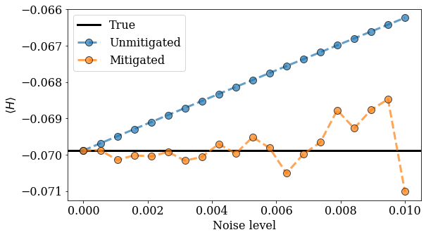

.. mitiq documentation file

*************************************************************
Defining Hamiltonians as Linear Combinations of Pauli Strings
*************************************************************

This tutorial shows an example of using Hamiltonians defined as :class:`~cirq.PauliSum` objects or similar objects in other
supported frontends. The usage of these Hamiltonian-like objects does not change the interface with Mitiq, but we
show an example for users who prefer these constructions.

Specifically, in this tutorial we will mitigate the expectation value of the Hamiltonian

.. math::
  H := 1.5 X_1 Z_2 - 0.7 Y_1

on two qubits.

Setup
#####

First we import libraries for this example.

.. testcode::

    from functools import partial

    import matplotlib.pyplot as plt
    import numpy as np

    import cirq
    from mitiq.zne import execute_with_zne
    from mitiq.zne.inference import LinearFactory

Defining the Hamiltonian
########################

Now we define the Hamiltonian as a :class:`~cirq.PauliSum` by defining the Pauli strings :math:`X_1 Z_2` and :math:`Y_1` then
taking a linear combination of these to create the Hamiltonian above.

.. testcode::

    # Qubit register
    qreg = cirq.LineQubit.range(2)

    # Two Pauli operators
    string1 = cirq.PauliString(cirq.ops.X.on(qreg[0]), cirq.ops.Z.on(qreg[1]))
    string2 = cirq.PauliString(cirq.ops.Y.on(qreg[1]))

    # Hamiltonian
    ham = 1.5 * string1 - 0.7 * string2

By printing the Hamiltonian we see:

.. doctest::

    >>> print(ham)
    1.500*X(0)*Z(1)-0.700*Y(1)

Note that we could have created the Hamiltonian by directly defining a :class:`~cirq.PauliSum` with the coefficients.

Using the Hamiltonian in the executor
#####################################

To interface with Mitiq, we define an ``executor`` function which maps an input (noisy) circuit to an expectation
value. In the code block below, we show how to define this function and return the expectation of the Hamiltonian above.

.. testcode::

    def executor(
        circuit: cirq.Circuit,
        hamiltonian: cirq.PauliSum,
        noise_value: float
    ) -> float:
        """Runs the circuit and returns the expectation value of the Hamiltonian.

        Args:
            circuit: Defines the ansatz wavefunction.
            hamiltonian: Hamiltonian to compute the expectation value of w.r.t. the ansatz wavefunction.
            noise_value: Probability of depolarizing noise.
        """
        # Add noise
        noisy_circuit = circuit.with_noise(cirq.depolarize(noise_value))

        # Get the final density matrix
        dmat = cirq.DensityMatrixSimulator().simulate(noisy_circuit).final_density_matrix

        # Return the expectation value
        return hamiltonian.expectation_from_density_matrix(
            dmat,
            qubit_map={ham.qubits[i]: i for i in range(len(ham.qubits))}
        ).real

This executor inputs a Hamiltonian as well as a noise value, adds noise, then uses the
:meth:`cirq.PauliSum.expectation_from_density_matrix` method to return the expectation value.

The remaining interface is as usual with Mitiq. For the sake of example, we show an application mitigating the
expectation value of :math:`H` with an example ansatz at different noise levels.

Example usage
#############

Below we create an example ansatz parameterized by one angle :math:`\gamma`.

.. testcode::

    def ansatz(gamma: float) -> cirq.Circuit:
        """Returns the ansatz circuit."""
        return cirq.Circuit(
            cirq.ops.ry(gamma).on(qreg[0]),
            cirq.ops.CNOT.on(*qreg),
            cirq.ops.rx(gamma / 2).on_each(qreg),
            cirq.ops.CNOT.on(*qreg),
        )

For the angle :math:`\gamma = \pi`, this ansatz has the following structure:

.. doctest::

    >>> print(ansatz(gamma=np.pi))
    0: ───Ry(π)───@───Rx(0.5π)───@───
                  │              │
    1: ───────────X───Rx(0.5π)───X───

We now compute expectation values of :math:`H` using the ``executor`` as follows.

.. testcode::

    pvals = np.linspace(0, 0.01, 20)
    expvals = [executor(ansatz(gamma=np.pi), ham, p) for p in pvals]

We can compute mitigated expectation values at these same noise levels by running the following. Here, we use a
:class:`.LinearFactory` and use the ``partial`` function to update the ``executor`` for each noise value. The latter point
ensures ``this_executor`` has the correct signature (input circuit, output float) to use with :func:`.execute_with_zne`.

.. testcode::

    fac = LinearFactory(scale_factors=list(range(1, 6)))
    mitigated_expvals = []

    for p in pvals:
        this_executor = partial(executor, hamiltonian=ham, noise_value=p)
        mitigated_expvals.append(
            execute_with_zne(ansatz(gamma=np.pi), this_executor, factory=fac)
        )

We can now visualize the effect that error mitigation has by running the following code for plotting.

.. testcode::

    plt.rcParams.update({"font.family": "serif", "font.size": 16})
    plt.figure(figsize=(9, 5))

    plt.axhline(y=expvals[0], lw=3., label="True", color="black")
    plt.plot(pvals, expvals, "--o", lw=3, markersize=10, markeredgecolor="black", alpha=0.7, label="Unmitigated")
    plt.plot(pvals, mitigated_expvals, "--o", lw=3, markersize=10, markeredgecolor="black", alpha=0.7, label="Mitigated")

    plt.xlabel("Noise level")
    plt.ylabel(r"$\langle H \rangle$")
    plt.legend()
    plt.show()

This produces a plot of expectation value (unmitigated and mitigated) :math:`\langle H \rangle` vs. noise strength
:math:`p`. We include the true (noiseless) expectation value on the plot for comparison.

As we can see, the mitigated expectation values are closer, on average, to the true expectation value.

Sampling
########

Finally, we note that :math:`\langle H \rangle` can be estimated by sampling using the :class:`cirq.PauliSumCollector`. An
example of a ``sampling_executor`` which uses this is shown below.

.. testcode::

    def sampling_executor(
        circuit: cirq.Circuit,
        hamiltonian: cirq.PauliSum,
        noise_value: float,
        nsamples: int = 10_000
    ) -> float:
        """Runs the circuit and returns the expectation value of the Hamiltonian.

        Args:
            circuit: Defines the ansatz wavefunction.
            hamiltonian: Hamiltonian to compute the expectation value of w.r.t. the ansatz wavefunction.
            noise_value: Probability of depolarizing noise.
            nsamples: Number of samples to take per each term of the Hamiltonian.
        """
        # Add noise
        noisy_circuit = circuit.with_noise(cirq.depolarize(noise_value))

        # Do the sampling
        psum = cirq.PauliSumCollector(circuit, ham, samples_per_term=nsamples)
        psum.collect(sampler=cirq.Simulator())

        # Return the expectation value
        return psum.estimated_energy()

This executor can be used in the same way as the previously defined ``executor`` which used a density matrix simulation
to evaluate :math:`\langle H \rangle`.
