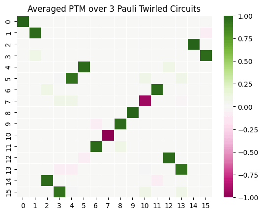

---
jupytext:
  text_representation:
    extension: .md
    format_name: myst
    format_version: 0.13
    jupytext_version: 1.14.1
kernelspec:
  display_name: Python 3
  language: python
  name: python3
---

```{tags} cirq, zne, pt, intermediate
```
# Zero-Noise Extrapolation with Pauli Twirling

This tutorial explores how noise tailoring can improve the effectiveness of quantum error mitigation techniques.
Specifically, we analyze how converting coherent noise into incoherent noise through [Pauli Twirling](../guide/pt.md) (PT)
 impacts the performance of [Zero-Noise Extrapolation](../guide/zne.md) (ZNE).

In this tutorial, we will:

1. Define and compare coherent and incoherent noise
2. Apply Pauli Twirling (PT) to transform coherent noise into incoherent noise
3. Compare the performance of ZNE
    1. on its own, and
    2. in combination with Pauli Twirling

By the end of the example, you will understand when and how noise tailoring can enhance ZNE.

## Coherent noise vs. Incoherent noise

Noise on quantum devices can be broadly categorized into two types: _coherent_ and _incoherent_. Each has different properties that can be unfavorable toward a quantum circuit in different ways.

**Coherent noise** is a reversible process as long as the noisy unitary transformation is known beforehand which is not always the case. These types of noise maintain the purity of the state. But in a quantum circuit subjected to coherent noise, the errors are easily carried across the circuit. This can be discerned through the **average gate infidelity** $r(\mathcal{E})$ where $\mathcal{E}$ is some noise channel. When coherent errors contribute to a portion of the total error-rate, the worst case infidelity can scale as $\sqrt{r(\mathcal{E})}$ {cite}`Wallman_2014` which in turn reduces the performance of a quantum device by orders of magnitude. Thus, dealing with coherent noise requires a large resource overhead to acquire inferred knowledge of the noise unitaries which can then be used to reverse the effects.

```{note}
If $\mathcal{F}$ is the average noisy gate fidelity {cite}`Nielsen_2002` defining the success of preparing an arbitrary pure state $\rho$, then $r(\mathcal{E}) := 1 - \mathcal{F}$ is called the **average gate infidelity**.
```

**Incoherent noise** is a process that results in the quantum system entangling with its environment i.e. this type of noise is irreversible. The system and the environment end up in a mixed state. This type of noise scales linearly in the small error limit. The noise channel can be described using Pauli operators which makes it easy to analyze and simulate. Worst case error rate is directly proportional to the **average gate infidelity**.

See the example in the [PTM and Average Gate Infideltiy](#ptm-and-average-gate-infidelity) section for more information on how
the error-rate scales for coherent and incoherent noise.

In scenarios where we want to reduce the effect of coherent noise, noise tailoring techniques like Pauli twirling are utilized
to transform it to incoherent noise. For example, a depolarizing noise channel is a stochastic noise channel where a noiseless process is probabilistically mixed with orthogonal errors. Pauli twirling strives to convert some noise channel into a Pauli noise channel or approximately close to a Pauli noise channel. This conversion is determined by the depth of the circuit, coherent noise strength and the total number of Pauli twirled circuits used. As shown in Eqs.{math:numref}`depolarizing_noise` and {math:numref}`depolarizing_noise_Paulis` below, a local depolarizing noise channel can be described using Paulis i.e. it can be said that Pauli twirling tailors a noise channel into a local depolarizing noise channel {cite}`Garc_a_Mart_n_2024`.  

If $\rho$ is a single qubit state, $p$ is the probabilistic error rate and $\mathcal{E}(\rho)$ is the noise channel:

$$
\mathcal{E}(\rho) = (1-p) \rho + p \frac{I}{2}
$$ (depolarizing_noise)

$\frac{I}{2}$ is the maximally mixed state which can be described using Paulis.

$$
\frac{I}{2} = \frac{1}{4} (\rho + X \rho X + Y \rho Y + Z \rho Z)
$$

Thus, the depolarizing channel can be redescribed using Paulis as shown below i.e. Pauli twirling will tailor the
noise to local depolarizing noise. 

$$
\mathcal{E}(\rho) = (1-\frac{3p}{4}) \rho + \frac{p}{4} (X \rho X + Y \rho Y + Z \rho Z)

$$(depolarizing_noise_Paulis)

### Pauli Transfer Matrix (PTM)

To visually demonstrate the differences between the two types of noise we introduce the Pauli Transfer Matrix (PTM). Let $\Lambda(\rho)$ be an $n$-qubit noise channel with corresponding $N$ Kraus operators $K_i$.

$$
\Lambda(\rho) = \sum_{i=1}^{N} K_i \rho {K_i}^\dagger 
$$(CPTP_map)

When all $K_i$ are $n$-qubit Pauli operators, the channel is called a **Pauli channel**.


If $P_i$ and $P_j$ are lexicographically ordered $n$-qubit Paulis $\forall P_i, P_j \in \{I, X, Y, Z \}^{\otimes n}$, the following Eq. {math:numref}`PTM_expression` defines the entries of a Pauli Transfer Matrix (PTM). Here, 
$i$ defines the rows while $j$ defines the columns of the PTM.

$$
(R_{\Lambda})_{ij} = \frac{1}{2^n} \text{Tr} \{ P_i \Lambda(P_j)\}
$$(PTM_expression)

All entries of the PTM are real and in the interval $[-1, 1]$. A PTM allows us to distinguish between the two types of noise since the off-diagonal terms of the PTM are due to the effect of coherent noise while the diagonal terms are due to incoherent noise. 

To find the PTM of an entire circuit, we only need to take the product of the PTM of each layer in the circuit. Due to this, it is straightforward to see how coherent noise carries across different layers in the circuit and how incoherent errors are easier to deal with in the small error limit. The latter is due to only focusing on the diagonal terms of the PTM for incoherent noise such that the product of two or more diagonal matrices is also a diagonal matrix.

The known fault tolerant thresholds for stochastic noise are higher than coherent noise which makes the former a 'preferable' type of noise compared to the latter. To avoid dealing with coherent noise, Pauli twirling can be used to tailor coherent noise to incoherent noise. Same as Eq {math:numref}`depolarizing_noise_Paulis`, when a coherent noise channel is Pauli twirled, the noise channel can be described using Paulis after averaging over multiple Pauli twirled circuits. Refer to the [Pauli Twirling user guide](../guide/pt.md) for additional information. 

It is worth noting that the number of Pauli twirled circuits required to transform coherent noise to incoherent noise depends on the circuit used, noise strength, etc.

Generally, the higher the number of generated twirled circuits, the better the result. Similarly, better results are obtained more quickly when the coherent noise strength is low.

### PTM and Average Gate Infidelity

With the PTM introduced, it is straightforward to show that coherent noise scales quadratically while incoherent noise scales linearly. Eq. {math:numref}`PTM_y_rotation` shows the PTM of a single-qubit noisy rotation about the Y-axis. 

$$
R_{Y_{\theta}}=\begin{pmatrix}
1 & 0 & 0 & 0\\
0 & \cos(\theta) & 0 & \sin(\theta)\\
0 & -\sin(\theta) & 0 & \cos(\theta)\\
0 & 0 & 0 & 1\\
\end{pmatrix}
$$(PTM_y_rotation)

The Taylor series expansions of $\cos(\theta)$ and $\sin(\theta)$ can be approximated as shown in Eq. {math:numref}`taylor_approx` in the small error limit.

$$
\cos(\theta) \approx 1 - \frac{{\theta}^2}{2!},\quad \sin(\theta) \approx \theta \\
\text{i.e. } \cos(\theta) \propto {\theta}^2,\quad \sin(\theta) \propto \theta
$$(taylor_approx)

Thus, the off-diagonal terms (coherent noise) of the PTM are quadratically worse $\sqrt{{\theta}^2}$ than the terms along the diagonal (incoherent noise) ${\theta}^2$ where ${\theta}^2$ denotes the average gate infidelity. 

As shown below in Eq. {math:numref}`r_e_values` these error-rate values can be connected to the notation introduced in an [earlier section](#coherent-noise-vs-incoherent-noise) differentiating the two types of noise.

$$
\text{Coherent noise: } \sqrt{r(\mathcal{E})} \approx \sqrt{{\theta}^2} \\
\text{Incoherent noise: } r(\mathcal{E}) \approx {\theta}^2
$$(r_e_values)

## Using Pauli Twirling in Mitiq

To demonstrate the differences in the two types of noise discussed in the previous section, we utilize ideal and noisy variations to a circuit comprising a CNOT gate and the functions available in the Pauli twirling module {mod}`.pt`.

```{code-cell} ipython3

import cirq
import numpy as np
import numpy.typing as npt
from cirq.circuits import Circuit
from itertools import product
from functools import reduce

from mitiq.pec.channels import _circuit_to_choi, choi_to_super
from mitiq.utils import matrix_to_vector, vector_to_matrix

Pauli_unitary_list = [
    cirq.unitary((cirq.I)),
    cirq.unitary((cirq.X)),
    cirq.unitary((cirq.Y)),
    cirq.unitary((cirq.Z)),
]


def n_qubit_paulis(num_qubits: int) -> list[npt.NDArray[np.complex64]]:
    """Get a list of n-qubit Pauli unitaries."""
    if num_qubits < 1:
        raise ValueError("Invalid number of qubits provided.")

    # get the n-qubit Paulis from the Pauli group
    # disregard the n-qubit Paulis with complex phase

    n_qubit_paulis = [reduce(lambda a, b: np.kron(a, b), combination)
        for combination in product(Pauli_unitary_list, repeat=num_qubits)]
    return n_qubit_paulis


def pauli_vectorized_list(num_qubits: int) -> list[npt.NDArray[np.complex64]]:
    """Define a function to create a list of vectorized matrices.

    If the density matrix of interest has more than n>1 qubits, the
    Pauli group is used to generate n-fold tensor products before
    vectorizing the unitaries.
    """
    n_qubit_paulis1 = n_qubit_paulis(num_qubits)
    output_Pauli_vec_list = []
    for i in n_qubit_paulis1:
        # the matrix_to_vector function stacks rows in vec form
        # transpose is used here to instead stack the columns
        matrix_trans = np.transpose(i)
        output_Pauli_vec_list.append(matrix_to_vector(matrix_trans))
    return output_Pauli_vec_list


def ptm_matrix(circuit: Circuit, num_qubits: int) -> npt.NDArray[np.complex64]:
    """Find the Pauli Transfer Matrix (PTM) of a circuit."""

    superop = choi_to_super(_circuit_to_choi(circuit))

    vec_Pauli = pauli_vectorized_list(num_qubits)
    n_qubit_paulis1 = n_qubit_paulis(num_qubits)
    ptm_matrix = np.zeros([4**num_qubits, 4**num_qubits], dtype=complex)

    for i in range(len(vec_Pauli)):
        superop_on_Pauli_vec = np.matmul(superop, vec_Pauli[i])
        superop_on_Pauli_matrix_transpose = vector_to_matrix(
            superop_on_Pauli_vec
        )
        superop_on_Pauli_matrix = np.transpose(
            superop_on_Pauli_matrix_transpose
        )

        for j in range(len(n_qubit_paulis1)):
            Pauli_superop_Pauli = np.matmul(
                n_qubit_paulis1[j], superop_on_Pauli_matrix
            )
            ptm_matrix[j, i] = (0.5**num_qubits) * np.trace(
                Pauli_superop_Pauli
            )

    return ptm_matrix
```

Let us consider a simple circuit of a CNOT gate. We are going to subject this circuit to two types of noise and compare
their respective PTMs.

```{code-cell} ipython3
import numpy as np
import seaborn as sns
import matplotlib.pylab as plt

from cirq import LineQubit, Circuit, CNOT, Ry, depolarize, X, Y, Z

q0 = LineQubit(0)
q1 = LineQubit(1)

circuit = Circuit(CNOT(q0, q1))
print(circuit)
```
```{code-cell} ipython3
ptmcnot = ptm_matrix(circuit, 2)
ax = sns.heatmap(ptmcnot.real, linewidth=0.5, vmin=-1, vmax=1, cmap="PiYG")
ax.set_title('Ideal CNOT PTM')
plt.show()
```
```{code-cell} ipython3
# PTM of a noisy CNOT gate: depolarizing noise
noisy_circuit_incoherent = circuit.with_noise(depolarize(p=0.3))
print(noisy_circuit_incoherent)

ptmcnot = ptm_matrix(noisy_circuit_incoherent, 2)
ax = sns.heatmap(ptmcnot.real, linewidth=0.5, vmin=-1, vmax=1, cmap="PiYG")
ax.set_title('PTM of noisy CNOT (incoherent)')
plt.show()
```
```{code-cell} ipython3
# PTM of a noisy CNOT gate: Rz
noisy_circuit_coherent = circuit.with_noise(Ry(rads=np.pi/12))
print(noisy_circuit_coherent)

ptmcnot = ptm_matrix(noisy_circuit_coherent, 2)
ax = sns.heatmap(ptmcnot.real, linewidth=0.5, vmin=-1, vmax=1, cmap="PiYG")
ax.set_title('PTM of noisy CNOT (coherent)')
plt.show()
```
If we compare the PTM of the ideal CNOT gate to those when the gate was subjected to incoherent noise and coherent noise, 
there are additional sources of errors to deal with when coherent noise is acting on the CNOT gate. These can be reduced or tailored to be close to how the incoherent noise PTM appears through Pauli Twirling.

```{code-cell} ipython3
from mitiq.pt import generate_pauli_twirl_variants


NUM_TWIRLED_VARIANTS = 3

twirled_circuits = generate_pauli_twirl_variants(
    circuit,
    num_circuits=NUM_TWIRLED_VARIANTS,
)
print("Example ideal twirled circuit", twirled_circuits[-1], sep="\n")
```
Now, lets add coherent noise to the CNOT gate in each twirled circuit.
```{code-cell} ipython3

noisy_twirled_circuits = []

for circ in twirled_circuits:
    split_circuit = Circuit(circ[0], circ[1], Ry(rads=np.pi/12)(q0), Ry(rads=np.pi/12)(q1), circ[-1])
    noisy_twirled_circuits.append(split_circuit)

print("Example noisy twirled circuit", noisy_twirled_circuits[-1], sep="\n")
```

The twirled PTM is averaged over each noisy twirled circuit such that the new PTM is close to that of the PTM of incoherent noise. We skip the step in this section as we require a very large number of twirled circuits to demonstrate the desired effect of averaging over multiple numpy arrays. The variations in Pauli twirled PTMs are shown below when averaged over a different number of Pauli twirled circuits.  



The off-diagonal values in the heatmap fade steadily as the number of twirled circuits averaged over is increased. In particular, for the last plot, the PTM of 100 Pauli twirled circuits is equivalent to the ideal CNOT PTM. 

## Noisy ZNE

Let's define a larger circuit of CNOT and H gates. 

```{code-cell} ipython3

from mitiq.benchmarks import generate_ghz_circuit

circuit = generate_ghz_circuit(n_qubits=7)

print(circuit)

```

We are going to add coherent noise to this circuit and then get the error-mitigated expectation value. For a detailed discussion on this, refer to the [ZNE user guide](../guide/zne-1-intro.md). 

As we are using a simulator, we have to make sure the noise model adds coherent noise to CZ/CNOT gates in our circuit. For this, `get_noise_model` is used to add noise to CZ/CNOT gates. See [PT user guide](../guide/pt-1-intro.md) for more. 

```{code-cell} ipython3
from numpy import pi
from cirq import CircuitOperation, CXPowGate, CZPowGate, DensityMatrixSimulator
from cirq.devices.noise_model import GateSubstitutionNoiseModel

def get_noise_model(noise_level: float) -> GateSubstitutionNoiseModel:
    """Substitute each CZ and CNOT gate in the circuit
    with the gate itself followed by an Ry rotation on the output qubits.
    """
    rads = pi / 2 * noise_level
    def noisy_c_gate(op):
        if isinstance(op.gate, (CZPowGate, CXPowGate)):
            return CircuitOperation(
                Circuit(
                    op.gate.on(*op.qubits), 
                    Ry(rads=rads).on_each(op.qubits),
                ).freeze())
        return op

    return GateSubstitutionNoiseModel(noisy_c_gate)

def execute(circuit: Circuit, noise_level: float):
    """Returns Tr[ρ |0⟩⟨0|] where ρ is the state prepared by the circuit."""
    return (
        DensityMatrixSimulator(noise=get_noise_model(noise_level=noise_level))
        .simulate(circuit)
        .final_density_matrix[0, 0]
        .real
    )


# Set the intensity of the noise
NOISE_LEVEL = 0.2


# Compute the expectation value of the |0><0| observable
# in both the noiseless and the noisy setup
ideal_value = execute(circuit, noise_level=0.0)
noisy_value = execute(circuit, noise_level=NOISE_LEVEL)

NUM_TWIRLED_VARIANTS = 300
twirled_circuits = generate_pauli_twirl_variants(circuit, num_circuits=NUM_TWIRLED_VARIANTS)

# Average results executed over twirled circuits
from functools import partial
from mitiq import Executor
pt_vals = Executor(partial(execute, noise_level=NOISE_LEVEL)).evaluate(twirled_circuits)
twirled_result = np.average(pt_vals)


print(f"Error without twirling: {abs(ideal_value - noisy_value) :.3}")
print(f"Error with twirling: {abs(ideal_value - twirled_result) :.3}")
```

It is worth noting that Pauli twirling's goal is to only tailor the noise from coherent to incoherent. 

Depending on the noise strength, type of coherent noise etc. this transformation might not give better results after the Pauli twirled circuit is executed. See the plot in the [next section](#combining-pauli-twirling-with-zne) for an example.


## Combining Pauli Twirling with ZNE

```{code-cell} ipython3
from mitiq.zne import execute_with_zne
from typing import List

executor=partial(execute, noise_level=NOISE_LEVEL)

def combine_zne_pt(list_circuits, executor) -> List[float]:
    zne_pt_vals = []

    for twirled_circuit in list_circuits:
        zne_pt_vals.append(execute_with_zne(twirled_circuit, executor))

    return(np.average(zne_pt_vals))

mitigated_result = combine_zne_pt(twirled_circuits, executor)

print(f"Error without twirling: {abs(ideal_value - noisy_value) :.3}")
print(f"Error with twirling: {abs(ideal_value - twirled_result) :.3}")
print(f"Error with ZNE + PT: {abs(ideal_value - mitigated_result) :.3}")

```
Again, depending on the noise strength, type of noise, etc. a combination of PT and ZNE do not work that well compared to just PT or ZNE. Thus, it is important to understand when combining a noisy tailoring technique with an error mitigation technique provides a significant advantage. 

```{code-cell} ipython3

import matplotlib.pyplot as plt

# Plot error vs noise strength
noise_strength = np.linspace(0.0, 1.0, 50)
error_no_zne_no_twirling = []
error_with_twirling = []
error_with_twirling_and_zne = []
zne_vals = []
NUM_TWIRLED_VARIANTS = 30

ideal_value = execute(circuit, noise_level=0.0)

for strength in noise_strength:

    # get noisy expectation values and compare to ideal
    noisy_value = execute(circuit, noise_level=strength)
    id_noisy_diff = abs(ideal_value-noisy_value)
    error_no_zne_no_twirling.append(id_noisy_diff)

    # get expectation values after pauli twirling and compare to ideal
    twirled_circuits = generate_pauli_twirl_variants(circuit, num_circuits=NUM_TWIRLED_VARIANTS)
    pt_vals = Executor(partial(execute, noise_level=strength)).evaluate(twirled_circuits)
    twirled_result = np.average(pt_vals)
    twirled_noisy_diff = abs(ideal_value-twirled_result)
    error_with_twirling.append(twirled_noisy_diff)

    # get expectation values after ZNE and compare to ideal
    executor=partial(execute, noise_level=strength)
    zne_vals.append(abs(ideal_value - execute_with_zne(circuit, executor)))

    # get expectation values after combining pauli twirling and ZNE then compare to ideal
    mitigated_twirled_result = combine_zne_pt(twirled_circuits, executor)
    error_with_twirling_and_zne.append(abs(ideal_value - mitigated_twirled_result))


plt.plot(noise_strength, error_no_zne_no_twirling,"", label=r"|Ideal - Noisy|", color="#1f77b4")
plt.plot(noise_strength, zne_vals, "", label=r"|Ideal - ZNE|", color="#bcbd22")
plt.plot(noise_strength, error_with_twirling,"", label=r"|Ideal - Twirling|", color="#ff7f0e")
plt.plot(noise_strength, error_with_twirling_and_zne, "", label=r"|Ideal - (ZNE + Twirling)|", color="#2ca02c")

plt.xlabel(r"noise_strength," "\n" r"Coherent noise: $R_y(\frac{\pi}{2} \times \text{noise_strength})$")
plt.ylabel("Absolute Error")
plt.title("Comparison of expectation values with ideal as a function of noise strength")
plt.legend()
plt.show()
```

As we are plotting the difference between the ideal expectation value and the noisy, error-mitigated and/or noise-tailored
expectation values, the closer the curve is to `0.0` on the Y-axis, the technique provides an advantage.


```{warning}
You can get better results if you control the number of samples in `noise_strength` in addition to using a higher number for
`NUM_TWIRLED_VARIANTS`. We have chosen to not do so to reduce execution time for this tutorial.
```

## Conclusion

In this tutorial, we've shown how to use a noise tailoring method with Zero-Noise Extrapolation.
If you're interested in finding out more about these techniques, check out their respective sections of the users guide: [ZNE](../guide/zne.md), [Pauli Twirling](../guide/pt.md).

