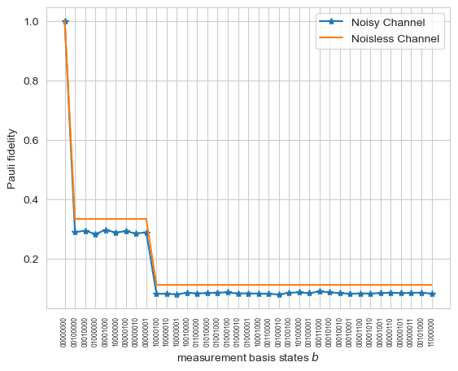
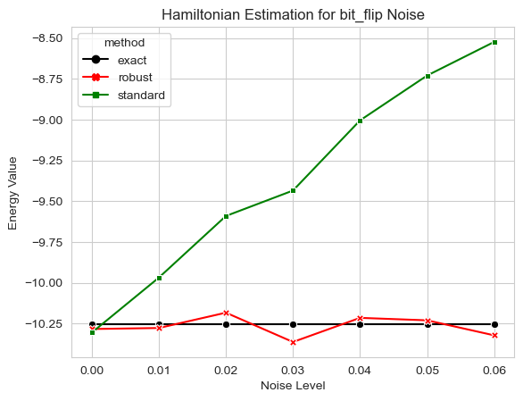
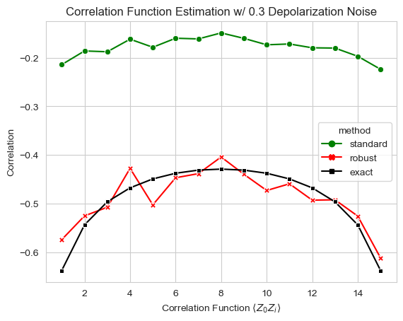

---
jupytext:
  text_representation:
    extension: .myst
    format_name: myst
    format_version: 0.13
    jupytext_version: 1.11.1
kernelspec:
  display_name: Python 3 (ipykernel)
  language: python
  name: python3
---
# Robust Shadow Estimation with Mitiq

This notebook is a prototype of how to perform robust shadow estimation protocol with mitiq.


```python
import cirq
import numpy as np
from typing import List

from mitiq.shadows.shadows import *
from mitiq.shadows.quantum_processing import *
from mitiq.shadows.classical_postprocessing import *
from mitiq.shadows.shadows_utils import *
from mitiq import MeasurementResult
from mitiq.interface.mitiq_cirq.cirq_utils import (
    sample_bitstrings as cirq_sample_bitstrings,
)
from functools import partial

# auto reload modules when they have changed
%load_ext autoreload
%autoreload 2
```

    The autoreload extension is already loaded. To reload it, use:
      %reload_ext autoreload


The *robust shadow estimation*{cite}`chen2021robust` approach put forth in *Predicting Many Properties of a Quantum System from Very Few Measurements* {cite}`huang2020predicting` exhibits noise resilience. The inherent randomization in the protocol simplifies the noise, transforming it into a Pauli noise channel that can be characterized relatively straightforwardly. Once the noisy channel $\widehat{\mathcal{M}}$ is characterized $\widehat{\mathcal{M}}$, it is incorporated into the channel inversion $\widehat{\mathcal{M}}^{-1}$, resulting in an unbiased state estimator. The sampling error in the determination of the Pauli channel contributes to the variance of this estimator. 

## 1. Define Quantum Circuit and Executor
In this notebook, we'll use the ground state of the Ising model with periodic boundary conditions as an example to study energy and two-point correlation function estimations. We'll compare the performance of robust shadow estimation with the standard shadow protocol, taking into account the bit-flip or depolarization noise on the quantum channels.

The Hamiltonian of the Ising model is given by
\begin{equation}
H = -J\sum_{i=0}^{n-1} Z_i Z_{i+1} -  g\sum_{i=1}^N X_i,
\end{equation}
We focus on the case where $J = g =1$. We use the ground state of such a system eight spins provided by 


```python
# import groud state of 1-D Ising model w/ periodic boundary condition
from tensorflow_quantum.datasets import tfi_chain
num_qubits = 8
qubits: List[cirq.Qid] = cirq.LineQubit.range(num_qubits)
qbs = cirq.GridQubit.rect(num_qubits, 1)
circuits, labels, pauli_sums, addinfo = tfi_chain(qbs, "closed")
lattice_idx = 40  # Critical point where g == 1
g = addinfo[lattice_idx].g

circuit = circuits[lattice_idx]
qubit_map = {
    cirq.GridQubit(i, 0): cirq.LineQubit(i) for i in range(num_qubits)
}

circuit = circuit.transform_qubits(qubit_map=qubit_map)
```

similar with the classical shadow protocal, we define the executor to perform the computational measurement for the circuit. Here we use the simulator that adds single-qubit depolarizing noise after rotation gates and before the $Z$-basis measurement, as the noise is assumped to be gate independent, time invariant and Markovian, the noisy gate satisfies $U_{\Lambda_U}(M_z)_{\Lambda_{\mathcal{M}_Z}}\equiv U\Lambda\mathcal{M}_Z$:


```python
def cirq_executor(
    circuit: cirq.Circuit,
    noise_model_function=cirq.depolarize,
    noise_level=(0.2,),
    sampler=cirq.Simulator(),
) -> MeasurementResult:
    """
    This function returns the measurement outcomes of a circuit with bitflipped measurements.
    Args:
        circuit: The circuit to execute.
    Returns:
        A one shot MeasurementResult object containing the measurement outcomes.
    """
    circuit = circuit.copy()
    qubits = sorted(list(circuit.all_qubits()))
    if noise_level[0] > 0:
        noisy_circuit = cirq.Circuit()
        operations = list(circuit)
        n_ops = len(operations)
        for i, op in enumerate(operations):
            if i == n_ops - 1:
                noisy_circuit.append(
                    cirq.Moment(
                        *noise_model_function(*noise_level).on_each(*qubits)
                    )
                )
            noisy_circuit.append(op)
        circuit = noisy_circuit
    # circuit.append(cirq.Moment(*noise_model_function(*noise_level).on_each(*qubits)))
    executor = cirq_sample_bitstrings(
        circuit,
        noise_model_function=None,
        noise_level=(0,),
        shots=1,
        sampler=sampler,
    )
    return executor

```

## 2. Pauli Twirling Calibration
### 2.1 Pauli-transfer-matrix (PTM) representation (or Liouville representation)
The Pauli Transfer Matrix (PTM) representation, or Liouville representation, is initially introduced to streamline the notation. We must recognize that all linear operators $\mathcal{L}(\mathcal{H}_d)$ upon the underlying Hilbert space $\mathcal{H}_d$ of $n$-qubits, where $d = 2^n$, can possess a vector representation utilizing the $n$-qubit normalized Pauli operator basis $\sigma_a=P_a/\sqrt{d}$. Here, $P_a$ represents the conventional Pauli matrices.

For a linear operator $O\in\mathcal{L}(\mathcal{H}_d)$, a vector $|O\rangle\!\rangle \in\mathcal{H}_{d^2}$ is defined, where the $a$-th entry is $|O\rangle\!\rangle_a = d^{-1/2}\mathrm{Tr}(OP_a)$. The vector space $\mathcal{H}_{d^2}$'s inner product is established by the Hilbert-Schmidt inner product, represented as $\langle\!\langle A|B\rangle\!\rangle := \mathrm{Tr}(A^\dagger B)$. Therefore, the normalized Pauli basis $\{\sigma_a\}_a$ creates an orthonormal basis in $\mathcal{H}_{d^2}$, this is implemented in function `operator_ptm_vector_rep`. For example $|\sigma_I\rangle\!\rangle$ have a vector rep:


```python
operator_ptm_vector_rep(cirq.I._unitary_()/np.sqrt(2))
```

    array([1.+0.j, 0.+0.j, 0.+0.j, 0.+0.j])


### 2.2 Pauli Twilling of quantum channel and Pauli Fideltiy
The classical shadow estimation employs a quantum channel, which is subsequently inverted. This operation essentially embodies a Pauli twirling. Within this framework, $\mathcal{G}$ represents a subset, to be further identified within the unitaries in $U(d)$. Moreover, $\mathcal{U}$ personifies the PTM representation of $U$. As $\mathcal{G}$ takes the form of a group, the PTMs ${\mathcal{U}}$ evolve into a representation of $\mathcal{G}$. The implementation of Schur’s Lemma facilitates the direct computation of the precise form of $\widehat{\mathcal{M}}$ when the noisy channel $\Lambda$, representing both the gate noise $\mathcal{U}$ and the measurement noise $\mathcal{M}_Z$, is integrated:
\begin{align}
\widehat{\mathcal{M}} = \mathbb{E}_{\mathcal{G}}[\mathcal{U}^\dagger\mathcal{M}_z\Lambda\mathcal{U}] = \sum_{\lambda}\hat{f}_\lambda\Pi_\lambda,\qquad \hat{f}_\lambda:=\frac{\mathrm{Tr}(\mathcal{M}_z\Lambda\Pi_\lambda)}{\mathrm{Tr}(\Pi_\lambda)}
\end{align}
where $\mathbb{R}_{\mathcal{G}}$ symbolizes the set of irreducible sub-representations of the group $\mathcal{G}$. The total number of these coefficients is related to the number of irreducible representations in the PTM representation of the twirling group $\mathcal{G}$. $\Pi_\lambda$, on the other hand, denotes the corresponding projector onto the invariant subspace, which exhibits pairwise orthogonality.

When the subgroup of $U(d)$ is the local Clifford group $Cl_2^{\otimes n}$, the  projection onto irreducible representation can be decomposed into projections acting on each qubit: $\Pi_b=\bigotimes_{i=1}^n\Pi_{b_i}$, where $b_i\in\{0,1\}$ specifies the measurement basis state. Here is the equation for this relationship:
\begin{align}
        \Pi_{b_i}=\left\{
        \begin{array}{ll}
        |\sigma_0\rangle\!\rangle\langle\!\langle\sigma_0|& b_i=0 \\
        \mathbb{I}- |\sigma_0\rangle\!\rangle\langle\!\langle\sigma_0|& b_i = 1 
        \end{array}\right.
\end{align}
Therefore, the $n$-qubit local Clifford group has $2^n$ irreps.

The expansion coefficients of the twirled channel, $\{\hat{f}_{b}\}_b$, are referred to as the Pauli fidelity. Being twirled by the local Clifford group, the channel $\widehat{M}$ becomes a Pauli channel that is symmetric among the $x, \;y,\; z$ indices. This sequence results in a computational basis measurement outcome $|b\rangle$ interpreted in terms of bitstrings b: $\{0,1\}^{n}$. Subsequently, compute the single-round Pauli fidelity estimator $\hat{f}^{(r)}_b = \langle\!\langle b|\mathcal{U}|P_b\rangle\!\rangle$ for every possible measurement outcome bitstring b: $\{0,1\}^n$, with $|P_b\rangle\!\rangle=\prod_i|P_{Z}^{b_i}\rangle\!\rangle$.

The Pauli fidelity estimator for the local Clifford group can be computed utilizing the subsequent equation:
\begin{align}
\hat{f}^{(r)}_b = \prod_{i=1}^n \langle\!\langle b_i|\mathcal{U}_i|P_z^{b_i}\rangle\!\rangle
\end{align}
which was realized by function `get_single_shot_pauli_fidelity`.


Repeat the above step for $R = NK$ rounds. Then the final estimation of fz is given by a median of means estimator $\hat{f}_m$ constructed from the single round estimators $\{\hat{f}_m^{(r)}\}_{1\leq r\leq R}$ with parameter $N, \;K$:
calculate $K$ estimators each of which is the average of $N$ single-round estimators $\hat{f}$, and take the median of these $K$ estimators as our final estimator $\hat{f}$. In formula,
\begin{align}
&\bar{f}^{(k)}=\frac{1}{N}\sum_{r=(K-1)N+1}^{KN} \hat{f}^{(r)}\\
& \hat{f} = \mathrm{median}\{\bar{f}^{(1)},\cdots\bar{f}^{(K)}\}_{1\leq k\leq K}
\end{align}
the number of $\{f_m\}$ is related to the number of irreducible representations in the PTM representation of the twirling group, when the twirling group is the local Clifford group, the number of irreducible representations is $2^n$. This was realized in fucntion `mitiq.shadows.classical_postprocessing.get_pauli_fidelity`.

### 2.3 Noiseless Pauli Fidelity --- Ideal Inverse channal vs Estimate Noisy Inverse channel
One could check that in the absence of noise in the quantum gates ($\Lambda\equiv\mathbb{I}$), the value of the Pauli fidelity $\hat{f}_{b}^{\mathrm{ideal}}\equiv \mathrm{Tr}(\mathcal{M}_z \Pi_b)/\mathrm{Tr}\Pi_b = 3^{-|{b}|}$, where $|b|$ is the count of $|1\rangle$ found in z-eigenstates $|b\rangle:=|b_i\rangle^{\otimes n}$.

When the noisy channel is considered, the inverse channel $\widehat{\mathcal{M}}^{-1}$ can be abtained by inverse the noisy quantum channel $\widehat{\mathcal{M}}$, one has
\begin{align}
\widehat{\mathcal{M}}^{-1}=\sum_{b\in\{0,1\}^{\otimes n}}\hat{f}_b^{-1}\Pi_b
\end{align}
After the above steps, we can preform robust shadow calibration as we did in the standart classical shadow protocal, the only difference is we perform the inverse channel replaced by the calibrated version $\widehat{\mathcal{M}}^{-1}$. One can see that the noisy inverse channel $\mathrm{Tr}(\mathcal{M}_z \Pi_b)$ is differed from the one added on the classical shadow protocal by there difference on the Pauli fidelity $\hat{f}_b^{-1}$.


```python
n_total_measurements_calibration = 20000
noisy_executor = partial(cirq_executor, noise_level=(0.2,))
f_est_results = pauli_twirling_calibrate(
    qubits=qubits,
    executor=noisy_executor,
    k_calibration=5,
    num_total_measurements_calibration=n_total_measurements_calibration,
    locality=2,
)
```

```python
# sort bitstrings (b_lists' string rep) by number of 1s
bitstrings = np.array(sorted(list(f_est_results.keys())))

# reorder f_est_results by number of '1' in bitstrings
counts = {bitstring: bitstring.count("1") for bitstring in bitstrings}
order = np.argsort(list(counts.values()))
reordered_bitstrings = bitstrings[order]

# solve for theoretical Pauli fidelitys
f_theoretical = {}
bitstrings = list(f_est_results.keys())
for bitstring in bitstrings:
    n_ones = bitstring.count("1")
    f_val = 3 ** (-n_ones)
    f_theoretical[bitstring] = f_val
```

```python
import matplotlib.pyplot as plt
# plot estimated vs theoretical Pauli fidelitys when no errors in quantum circuit
plt.plot(
    [np.abs(f_est_results[b]) for b in reordered_bitstrings],
    "-*",
    label="Noisy Channel",
)
plt.plot(
    [f_theoretical[b] for b in reordered_bitstrings], label="Noisless Channel"
)
plt.xlabel(r"measurement basis states $b$")
plt.xticks(range(len(reordered_bitstrings)), reordered_bitstrings, rotation='vertical', fontsize=6)

plt.ylabel("Pauli fidelity")
plt.legend()
```




## 3. Calibration of the operator expectation value estimation
The expectation value for a series of operators, denoted as $\{O_\iota\}_{\iota\leq M}$, has a snapshot version of expectation value estimation by random Pauli measurement $\widetilde{\mathcal{M}}=\bigotimes_{i}\widetilde{\mathcal{M}}_{P_i}$ and Pauli-twirling calibration $\widehat{\mathcal{M}}^{-1}=\sum_{b\in\{0,1\}^n}f_b^{-1}\bigotimes_{i}\Pi_{b_i\in b}$, which is given by
\begin{align}
\hat{o}_\iota &= \langle\!\langle O_\iota|{\hat{\rho}}\rangle\!\rangle \simeq \langle\!\langle O_\iota|\widehat{\mathcal{M}}^{-1}\widetilde{\mathcal{M}}|\rho\rangle\!\rangle=\sum_{b^{(1)}\in\{0,1\}^{n}}f_{b^{(1)}}^{-1}\left(\bigotimes_{i=1}^n \langle\!\langle P_i|\Pi_{b_i^{(1)}}\widehat{\mathcal{M}}_{P_i}\right)|\rho\rangle\!\rangle\nonumber\\ 
&=\sum_{b^{(1)}\in\{0,1\}^{n}}f_{b^{(1)}}^{-1}\prod_{i=1}^n \langle\!\langle P_i|\Pi_{b^{(1)}_i}\bigg|U_i^{(2)\dagger}|b_i^{(2)}\rangle\langle b_i^{(2)}|U_i^{(2)}\bigg\rangle\!\bigg\rangle
\end{align}
where in the last equality, $\{P_i\}_{i\in n}$ represents Pauli operators, with $P=\{I,X,Y,Z\}$. And as we did previously, we use the lable $(1)$ as the subscript to distinguish the parameters of the calibration process from the parameters of the shadow estimation process, which is labelled by $(2)$. It is assumed that $O_\iota$ are Pauli strings acting on $supp(O_\iota)$ ($|supp(O_\iota)|\leq n$) sites of the system. It can be verified that the cross product over qubit sites within the summation of the final expression in the above equation is zero, except when all sites in $supp(O_\iota)^c$ have $\Pi_0$ acting on. Similarly, it can be verified that the cross product over qubit sites within the summation of the final expression in the above equation is zero, except when all sites in $supp(O_\iota)$ have $\Pi_1$ acting on, i.e.
\begin{align}
\Pi_i|I\rangle\!\rangle\equiv\delta_{i,0}|I\rangle\!\rangle,\qquad \Pi_{i}|P\rangle\!\rangle\equiv\delta_{i,1}|P\rangle\!\rangle,\qquad ~~~ \mathrm{for}~i\in\{0,1\};~P\;=\{X,\;Y,\;Z\}.
\end{align}
Therefore, the final expression of the expectation value estimation can be simplified as
\begin{align}
\hat{o}_\iota = \left(\sum_{b^{(1)}\in\{0,1\}^{n}}f_{b^{(1)}}^{-1}\prod_{j\in supp(O_\iota)}
\delta_{b_j^{(1)},1}\prod_{k\in supp(O_\iota)^c}\delta_{b_k^{(1)},0}\right)\prod_{i=1}^n  \langle b_i^{(2)}|U_i^{(2)}P_i U_i^{(2)\dagger}|b_i^{(2)}\rangle
\end{align}
 Additionally, when $P_i =X_i$ (r.e.s.p. $Y_i,\;Z_i$), $U_i^{(2)}$ must correspond to $X$ (r.e.s.p. $Y,\;Z$)-basis measurement to yield a non-zero value, which is easy to check considered that the $P$-basis measurement channel has a PTM rep: $\widetilde{\mathcal{M}}_{P}=\frac{1}{2}(|I\rangle\!\rangle\langle\!\langle I|+|P\rangle\!\rangle\langle\!\langle P|)$, observiously the only measurement that didn't vanished by the operator's $i$-th qubit component in PTM rep: $P\rightarrow \langle\!\langle P|$, is the local $P$-basis measurement.  


Next steps are same with classical protocol,with the statistical method of taking an average called "median of means" to achieve an acceptable failure probability of estimation, which need $R_2=N_2K_2$ snapshots, where we use the subscript "2" to denote the index of classical shadow protocol. Acctually,
\begin{align}
\hat{o}_\iota(N_2,K_2):=\mathrm{median}\{\hat{o}_\iota^{(1)},\cdots,\hat{o}_\iota^{(K_2)}\}~~\mathrm{where}~~\hat{o}_\iota^{(j)}=N_2^{-1}\sum_{k=N_2(j-1)+1}^{N_2j}\mathrm{Tr}(O_\iota\hat{\rho}_k),\qquad \forall~1\leq j\leq K_2,
\end{align}
where we have $K_2$ estimators each of which is the average of $N_2$ single-round estimators $\hat{o}_i^{(j)}$, and take the median of these $K_2$ estimators as our final estimator $\hat{o}_\iota(N_2,K_2)$. We can calculate the median of means of each irreps with projection $\Pi_b=\bigotimes_{i=1}^n\Pi_{b_i}$, 


### 3.1 Ground State Energy Estimation of Ising model with the RSHADOWS algorithm

In this section, we will use the robust shadows estimation algorithm to estimate the ground state energy of the Ising model. We will use the `compare_shadow_methods` function to compare the performance of the robust shadows estimation algorithm and the classical shadows estimation algorithm. The `compare_shadow_methods` function takes the following parameters:


```python
from joblib import Parallel, delayed

def compare_shadow_methods(
    circuit,
    observables,
    n_measurement_calibration,
    k_calibration,
    n_measurement_shadow,
    k_shadows,
    locality,
    noise_model_fn,
    noise_level,
):

    noisy_executor = partial(
        cirq_executor,
        noise_level=(noise_level,),
        noise_model_function=noise_model_fn,
    )

    
    f_est = pauli_twirling_calibrate(
        qubits=sorted(list(circuit.all_qubits())),
        executor=noisy_executor,
        num_total_measurements_calibration=n_measurements_calibration,
        k_calibration=k_calibration,
        locality=locality,
    )
         
    shadow_measurement_result = shadow_quantum_processing(
        circuit,
        num_total_measurements_shadow=n_measurement_shadow,
        executor=noisy_executor)

    output_shadow = classical_post_processing(
        shadow_outcomes=shadow_measurement_result,
        rshadows=False,
        observables=observables,
        k_shadows=k_shadows,
    )

    output_shadow_cal = classical_post_processing(
        shadow_outcomes=shadow_measurement_result,
        rshadows=True,
        calibration_results=f_est,
        observables=observables,
        k_shadows=k_shadows,
    )
    return {"standard": output_shadow, "robust": output_shadow_cal}
```

We use the groud state of 1-D Ising model with periodic boundary condition, with $J= h=1$ for a Ising model with 8 spins as an example. The Hamiltonian is given by


```python
# define obersevables lists as Ising model Hamiltonian
from mitiq import PauliString

ising_hamiltonian = [
    PauliString("X", support=(i,), coeff=-g) for i in range(num_qubits)
] + [
    PauliString("ZZ", support=(i, (i + 1) % num_qubits), coeff=-1)
    for i in range(num_qubits)
]
```

Calculate the exact expectation values of the Pauli operators for the above state:


```python
state_vector = circuit.final_state_vector()
expval_exact = []
for i, pauli_string in enumerate(ising_hamiltonian):
    exp = pauli_string._pauli.expectation_from_state_vector(
        state_vector, qubit_map={q: i for i, q in enumerate(qubits)}
    )
    expval_exact.append(exp.real)
```

We use bit_flip channel as an example to show how to use the robust shadow estimation (RSE) in Mitiq. The bit_flip channel is a common noise model in quantum computing. It is a Pauli channel that flips the state of a qubit with probability $p$. 


```python
noise_levels = np.linspace(0, 0.06, 7)
# if noise_model is None, then the noise model is depolarizing noise
noise_model = "bit_flip"

standard_results = []
robust_results = []
noise_model_fn = getattr(cirq, noise_model)
for noise_level in noise_levels:
    est_values = compare_shadow_methods(
        circuit=circuit,
        observables=ising_hamiltonian,
        n_measurement_calibration=40000,
        k_calibration=1,
        n_measurement_shadow=40000,
        k_shadows=4,
        locality=2,
        noise_model_fn=cirq.bit_flip,
        noise_level=noise_level,
    )
    standard_results.append(est_values["standard"])
    robust_results.append(est_values["robust"])
```

                                                                      


```python
import pandas as pd

df_energy = pd.DataFrame(
    columns=["noise_model", "noise_level", "method", "observable", "value"]
)
for i, noise_level in enumerate(noise_levels):
    est_values = {}
    est_values["standard"] = list(standard_results[i].values())
    est_values["robust"] = list(robust_results[i].values())
    # for j in range(len(standard_est_values)):
    df_energy = pd.concat(
        [
            df_energy,
            pd.DataFrame(
                {
                    "noise_model": noise_model,
                    "noise_level": noise_level,
                    "method": "exact",
                    "observable": [str(ham) for ham in ising_hamiltonian],
                    "value": expval_exact,
                }
            ),
        ],
        ignore_index=True,
    )
    for method in ["standard", "robust"]:
        df_energy = pd.concat(
            [
                df_energy,
                pd.DataFrame(
                    {
                        "noise_model": noise_model,
                        "noise_level": noise_level,
                        "method": method,
                        "observable": [str(ham) for ham in ising_hamiltonian],
                        "value": est_values[method],
                    }
                ),
            ],
            ignore_index=True,
        )
    
```


```python
df_hamiltonian = df_energy.groupby(["noise_model", "noise_level", "method"]).sum()
df_hamiltonian = df_hamiltonian.reset_index()
noise_model = "bit_flip"
```

    /var/folders/fj/9qx1s04j6n713s58ml36xbbm0000gn/T/ipykernel_43506/2256291526.py:1: FutureWarning: The default value of numeric_only in DataFrameGroupBy.sum is deprecated. In a future version, numeric_only will default to False. Either specify numeric_only or select only columns which should be valid for the function.
      df_hamiltonian = df_energy.groupby(["noise_model", "noise_level", "method"]).sum()


```python
import seaborn as sns
sns.set_style("whitegrid")
%matplotlib inline

# Define a color palette
palette = {"exact": "black", "robust": "red", "standard": "green"}

plt.figure()
sns.lineplot(
    data=df_hamiltonian,
    x="noise_level",
    y="value",
    hue="method",
    palette=palette,  # Use the color palette defined above
    markers=True,
    style="method",
    dashes=False,
    ci=95,
)
plt.title(f"Hamiltonian Estimation for {noise_model} Noise")
plt.xlabel("Noise Level")
plt.ylabel("Energy Value")

```



### 3.2 Two Point Correlation Function Estimation with RShadows
Let's estimate two point correlation fuction: $\langle Z_0 Z_i\rangle$ of a 16-spin 1D Ising model with transverse field on critical point ground state.


Import groud state of 1-D Ising model with periodic boundary condition


```python
num_qubits = 16
qbs = cirq.GridQubit.rect(num_qubits, 1)
circuits, labels, pauli_sums, addinfo = tfi_chain(qbs, "closed")
lattice_idx = 40  # Critical point where g == 1
g = addinfo[lattice_idx].g
circuit = circuits[lattice_idx]
qubits = cirq.LineQubit.range(num_qubits)
qubit_map = {
    cirq.GridQubit(i, 0): cirq.LineQubit(i) for i in range(num_qubits)
}
circuit = circuit.transform_qubits(qubit_map=qubit_map)
```

Define obersevables lists as two point correlation functions between the first qubit and the rest of the qubits $\{\langle Z_0 Z_i\rangle\}_{0\geq i\leq n-1}$


```python
from mitiq import PauliString

two_pt_correlation = [
    PauliString("ZZ", support=(0, i), coeff=-1) for i in range(1, num_qubits)
]
```

Calculate the exact correlation function


```python
expval_exact = []
state_vector = circuit.final_state_vector()
for i, pauli_string in enumerate(two_pt_correlation):
    exp = pauli_string._pauli.expectation_from_state_vector(
        state_vector, qubit_map={q: i for i, q in enumerate(qubits)}
    )
    expval_exact.append(exp.real)
```

with depolarizing noise set to $0.1$, we compare the unmitigated and mitigated results:


```python
est_values = compare_shadow_methods(
    circuit=circuit,
    observables=two_pt_correlation,
    n_processes=10,
    n_measurement_calibration=50000,
    n_measurement_shadow=50000,
    k_shadows=5,
    locality=2,
    noise_model_fn=cirq.depolarize,
    noise_level=0.1,
    k_calibration=3,
)
```


```python
df_corr = pd.DataFrame(
    columns=["method", "qubit_index", "observable", "value"]
)
qubit_idxes = [max(corr.support()) for corr in two_pt_correlation]
# for j in range(len(standard_est_values)):
for method in ["standard", "robust"]:
    df_corr = pd.concat(
        [
            df_corr,
            pd.DataFrame(
                {
                    "method": method,
                    "qubit_index": qubit_idxes,
                    "observable": [str(corr) for corr in two_pt_correlation],
                    "value": list(est_values[method].values()),
                }
            ),
        ],
        ignore_index=True,
    )
df_corr = pd.concat(
    [
        df_corr,
        pd.DataFrame(
            {
                "method": "exact",
                "qubit_index": qubit_idxes,
                "observable": [str(corr) for corr in two_pt_correlation],
                "value": expval_exact,
            }
        ),
    ],
    ignore_index=True,
)
```


```python
# Define a color palette
palette = {"exact": "black", "robust": "red", "standard": "green"}

plt.figure()
sns.lineplot(
    data=df_corr,
    x="qubit_index",
    y="value",
    hue="method",
    palette=palette,  # Use the color palette defined above
    markers=True,
    style="method",
    dashes=False,
    ci=95,
)
plt.title(f"Correlation Function Estimation w/ 0.3 Depolarization Noise")
plt.xlabel(r"Correlation Function $\langle Z_0Z_i \rangle$")
plt.ylabel("Correlation")

```


    

** Acknowledgements**

This project contains code adapted from PennyLane's tutorial on Classical Shadows. We would like to acknowledge the original authors of the tutorial, PennyLane developers Brian Doolittle and Roeland Wiersema. The tutorial can be found at [this link](https://pennylane.ai/qml/demos/tutorial_classical_shadows).
