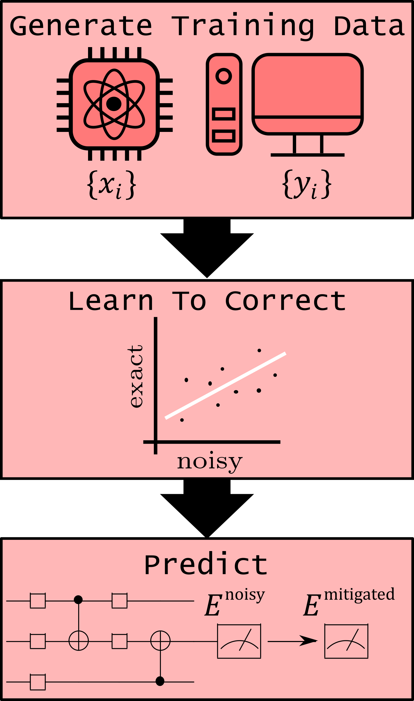

.. cdr:

************************
Clifford Data Regression
************************

Clifford Data Regression (CDR) is a learning-based quantum error mitigation technique :cite:`Czarnik_2020_arXiv`.

A figure of the typical workflow for CDR in Mitiq is shown in the figure below.

.. figure:: ../img/cdr_workflow2_steps.png
  :width: 400
  :alt: The CDR workflow in Mitiq is divided in two steps: Generating circuits, both for a classical simulator and on the intended backend, and then performing the inference from measurements to obtain a noise mitigated expectation value.
  :name: figcdr

  The figure illustrates the Clifford data regression (CDR) workflow in Mitiq.

The :ref:`CDR workflow Figure<figcdr>` above shows a schema of the implementation of CDR in Mitiq. Similarly to ZNE and PEC, also CDR in Mitiq is divided in two main stages: The first one of circuit generation and the second for inference of the mitigated value. However, in CDR, the generation of quantum circuits is more complex, as it involves first the generation of training data. The division of CDR into training, learning and prediction stages is shown in :ref:`the figure below<figcdr2>`.

  Near-Clifford approximations of the actual circuit are simulated, without noise, on a classical simulator (circuits can be efficiently simulated classically) and executed on the noisy quantum computer (or a noisy simulator). These results are used as training data to infer the zero-noise expectation value of the error miitigated original circuit, that is finally run on the quantum computer (or noisy simulator).

A simple hands-on tutorial on CDR can be found :ref:`here<label-cdr-example>`.

