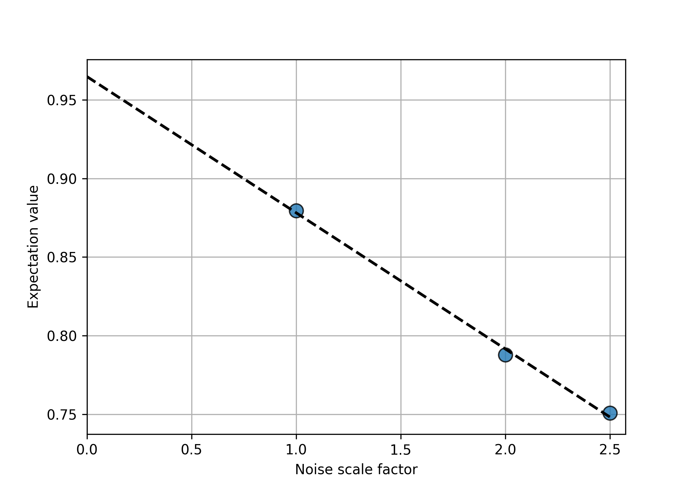

.. _guide-getting-started:

*********************************************
Getting Started
*********************************************

This guide shows short examples of two error mitigation techniques in Mitiq:
zero-noise extrapolation and probabilistic error cancellation.
First, we highlight the general workflow of both methods.

.. _multi_platform_framework:

General workflow: Front-ends, backends, and executors
-----------------------------------------------------

We refer to a library/language that constructs quantum programs as a "front-end,"
and a quantum computer or quantum computer simulator as a "backend." Mitiq currently
supports Cirq, Qiskit, PyQuil and Braket front-ends, and is backend agnostic - as long as you
can run a supported quantum program on a backend, you can use that backend with Mitiq.

We refer to a user-defined function that inputs a quantum program and executes it on a backend
as an *executor*. Such functions always accept a quantum program, sometimes accept other arguments,
and always return an expectation value as a float. As an example, below we define a simple executor
function which inputs a Cirq circuit, executes it on a noisy simulator, and returns the
probability of the ground state.

.. testcode::

    import numpy as np
    import cirq

    def executor(circ: cirq.Circuit) -> float:
        """Simulates a circuit with depolarizing noise.

        Args:
            circ: The quantum program as a Cirq object.

        Returns:
            The expectation value of the ground state projector.
        """
        circuit = circ.with_noise(cirq.depolarize(p=0.01))
        result = cirq.DensityMatrixSimulator().simulate(circuit)
        return np.real(result.final_density_matrix[0, 0])

Now we consider a simple example: a single-qubit circuit with an even
number of Pauli-X gates. By construction, the ideal expectation value should be
1, but the noisy expectation value will be slightly different.

.. testcode::

    circuit = cirq.Circuit(
        cirq.X(cirq.LineQubit(0)) for _ in range(6)
    )

    exact_result = 1.0
    noisy_result = executor(circuit)

    print(f"Error in noisy simulation: {abs(exact_result - noisy_result):.{3}}")

.. testoutput::

    Error in noisy simulation: 0.0387

This shows the impact of noise on the final expectation value (without error mitigation).
Now let's use Mitiq to improve this performance.

Zero-Noise Extrapolation
------------------------

Zero-noise extrapolation can be easily implemented with the function
:func:`mitiq.zne.zne.execute_with_zne`.

.. testcode::

    from mitiq import zne

    mitigated_result = zne.execute_with_zne(circuit, executor)

    print(f"Error without mitigation: {abs(exact_result - noisy_result):.{3}}")
    print(f"Error with mitigation (ZNE): {abs(exact_result - mitigated_result):.{3}}")

.. testoutput::

    Error without mitigation: 0.0387
    Error with mitigation (ZNE): 0.000232

You can also use Mitiq to wrap your backend execution function into an
error-mitigated version.

.. testcode::

    from mitiq.zne import mitigate_executor

    mitigated_executor = mitigate_executor(executor)
    mitigated_result = mitigated_executor(circuit)
    print(round(mitigated_result, 5))

.. testoutput::

    0.99977

.. _partial-note:

.. note::
   As shown here, Mitiq wraps executor functions that have a specific type:
   they take quantum programs as input and return expectation values. However,
   one often has an execution function with other arguments such as the number of
   shots, the observable to measure, or the noise level of a noisy simulation.
   It is still easy to use these with Mitiq by using partial function application.
   Here's a pseudo-code example:

   .. code-block::

      from functools import partial

      def shot_executor(qprogram, n_shots) -> float:
          ...
      # we partially apply the n_shots argument to get a function that just
      # takes a quantum program
      mitigated = execute_with_zne(circ, partial(shot_executor, n_shots=100))

   You can read more about ``functools`` partial application
   `here <https://docs.python.org/3/library/functools.html#functools.partial>`_.

By default, :func:`mitiq.zne.zne.execute_with_zne` uses Richardson extrapolation
to extrapolate the expectation value to the zero noise limit :cite:`Temme_2017_PRL`.
Mitiq comes equipped with other extrapolation methods as well. Different methods of
extrapolation are packaged into :class:`~mitiq.zne.inference.Factory` objects.
It is easy to try different ones.

.. testcode::

    fac = zne.inference.LinearFactory(scale_factors=[1.0, 2.0, 2.5])
    linear_zne_result = zne.execute_with_zne(circuit, executor, factory=fac)
    error = abs(exact_result - linear_zne_result)
    print(f"Mitigated error with linear ZNE: {error:.{3}}")

.. testoutput::

    Mitigated error with linear ZNE: 0.00769

You can use built-in methods from factories like :meth:`~mitiq.zne.inference.Factory.plot_data`
and :meth:`~mitiq.zne.inference.Factory.plot_fit` to plot the noise scale factors v. the expectation
value returned by the executor.

.. testcode::

   fac.plot_fit()

You can read more about the :class:`~mitiq.zne.inference.Factory` objects that are built into Mitiq
and how to create your own :ref:`here <guide_zne_factory>`.

Another key step in zero-noise extrapolation is to choose how your circuit is
transformed to scale the noise. You can read more about the noise scaling
methods built into Mitiq and how to create your
own :ref:`here <guide_zne_folding>`.

.. _qiskit_getting_started:

Zero-Noise Extrapolation with Qiskit
^^^^^^^^^^^^^^^^^^^^^^^^^^^^^^^^^^^^

Mitiq is designed to be agnostic to the stack that you are using. Thus for
Qiskit things work in the same manner as before. Since we are now using Qiskit,
we want to run the error mitigated programs on a Qiskit backend. Let's define
the new backend that accepts Qiskit circuits. In this case it is a simulator,
but you could also use a QPU.

.. testcode::

    import qiskit

    # For noisy simulation.
    from qiskit.providers.aer.noise import NoiseModel
    from qiskit.providers.aer.noise.errors.standard_errors import depolarizing_error

    backend = qiskit.Aer.get_backend("qasm_simulator")

    def qiskit_executor(circuit: qiskit.QuantumCircuit, shots: int = 4096) -> float:
        """Runs the quantum circuit with a depolarizing channel noise model at
        level NOISE.

        Args:
            circuit: Single-qubit quantum circuit to execute.
            shots: Number of shots to run the circuit on the back-end.

        Returns:
            The ground state probability of the single-qubit circuit.
        """
        # Use a depolarizing noise model.
        noise_model = NoiseModel()
        noise_model.add_all_qubit_quantum_error(
            depolarizing_error(0.001, 1),
            ["u1", "u2", "u3"],
        )

        # execution of the experiment
        job = qiskit.execute(
            circuit,
            backend,
            basis_gates=["u1", "u2", "u3"],
            # we want all gates to be actually applied,
            # so we skip any circuit optimization
            optimization_level=0,
            noise_model=noise_model,
            shots=shots,
            seed_transpiler=1,
            seed_simulator=1
        )
        results = job.result()
        counts = results.get_counts()
        expval = counts["0"] / shots
        return expval

We can then use this backend for our mitigation.

.. testcode::

    from qiskit import QuantumCircuit
    from mitiq.zne import execute_with_zne

    circ = QuantumCircuit(1, 1)
    for _ in range(100):
         _ = circ.x(0)
    _ = circ.measure(0, 0)

    exact = 1
    unmitigated = qiskit_executor(circ)
    mitigated = execute_with_zne(circ, qiskit_executor)

    # The mitigation should improve the result.
    assert abs(exact - mitigated) < abs(exact - unmitigated)

Note that :class:`~mitiq.zne.inference.Factory`'s are only used for fitting
classical data and are completely frontend/backend agnostic.

.. _pec_getting_started:

Probabilistic Error Cancellation
--------------------------------

The workflow for probabilistic error cancellation is very similar to that of zero-noise extrapolation.
In particular, we can use Probabilistic Error Cancellation (PEC) with the
same execution function (``executor``) and the same Cirq circuit (``circuit``) that
we have already defined in the :ref:`General Workflow <multi_platform_framework>` section.

PEC requires a good knowledge of the noise model and of the noise strength acting
on the system. In particular for each operation of the circuit, we need to build
a quasi-probability representation of the ideal unitary gate expanded in a basis
of noisy implementable operations. For more details behind the theory of PEC see
the :ref:`Probabilistic Error Cancellation <guide_qem_pec>` section.

In our simple case, ``circuit`` corresponds to the repetition of the same X gate,
whose representation in the presence of depolarizing noise can be obtained as follows:

.. testcode::

    from mitiq.pec import represent_operation_with_local_depolarizing_noise

    x_representation = represent_operation_with_local_depolarizing_noise(
        ideal_operation=cirq.Circuit(cirq.X(cirq.LineQubit(0))),
        noise_level=0.01,
    )

    print(x_representation)

.. testoutput::

    0: ───X─── = 1.010*0: ───X───-0.003*0: ───X───X───-0.003*0: ───X───Y───-0.003*0: ───X───Z───

.. note::

    Note that we use the same ``noise_level`` in the call to
    ``represent_operation_with_local_depolarizing_noise`` that we use for the
    noisy simulator (i.e., in the ``execute`` function). For this method of getting
    operation representations, it is important to provide a good estimate of
    the noise level so the representations are faithful.

The result above is an :class:`~mitiq.pec.types.types.OperationRepresentation` object which contains
the information for representing the ideal operation X (left-hand-side of the printed output)
as a linear combination of noisy operations (right-hand-side of the printed output).

We can now implement PEC by importing the function :func:`~mitiq.pec.pec.execute_with_pec` from the
:mod:`~mitiq.pec.pec` module.

.. testcode::

    from mitiq import pec

    exact_result = 1
    noisy_result = executor(circuit)
    pec_result = pec.execute_with_pec(
        circuit,
        executor,
        representations=[x_representation],
        random_state=0,
    )

    print(f"Error without mitigation: {abs(exact_result - noisy_result):.{3}}")
    print(f"Error with mitigation (PEC): {abs(exact_result - pec_result):.{3}}")

.. testoutput::

    Error without mitigation: 0.0387
    Error with mitigation (PEC): 0.00363

In addition to :func:`~mitiq.pec.pec.execute_with_pec`, you can also use Mitiq to wrap your
backend execution function into an error-mitigated version like you can with zero-noise
extrapolation.
