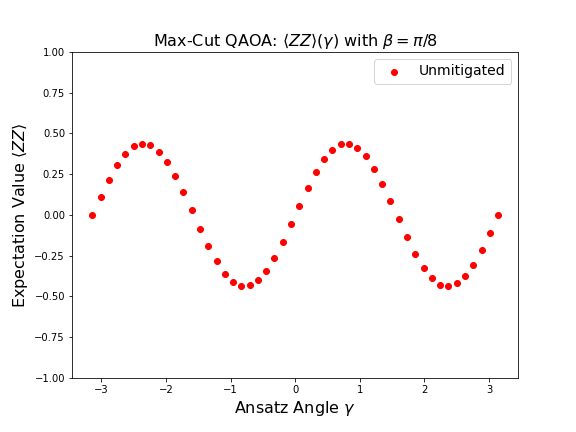
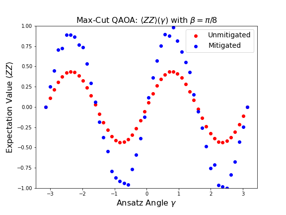

.. mitiq documentation file

.. _guide-ibmq-backends:

*********************************************
Mitigating a MaxCut Landscape with QAOA
*********************************************

This tutorial shows an example of mitigating the energy landscape for a two-qubit instance of MaxCut using the quantum
alternating operator ansatz (QAOA). We first import the libraries we will use.

.. testcode:: python

    import matplotlib.pyplot as plt
    import numpy as np

    from cirq import Circuit, CNOT, DensityMatrixSimulator, H, LineQubit, depolarize, rz
    from mitiq.zne.zne import mitigate_executor

    SIMULATOR = DensityMatrixSimulator()

We will use the density matrix simulator to compute the final density matrix of our noisy circuit, from which we then
compute expectation values to mitigate.

Defining the noiseless circuit
##############################

We define a function below which returns a two-qubit QAOA circuit at a specified driver angle :math:`\gamma`. The mixer
angle :math:`\beta` is set to :math:`\pi / 8` and we will sweep over :math:`\gamma` to compute an energy landscape.

.. testcode:: python

    def maxcut_qaoa_circuit(gamma: float) -> Circuit:
        """Returns two-qubit MaxCut QAOA circuit with beta = pi/8 and with the provided gamma.

        Args:
            gamma: One of the two variational parameters (the other is fixed).

        Returns:
            A two-qubit MaxCut QAOA circuit with fixed beta and gamma.
        """
        q0, q1 = LineQubit.range(2)

        return Circuit(
            H.on_each(q0, q1),
            CNOT.on(q0, q1),
            rz(2 * gamma).on(q1),
            CNOT.on(q0, q1),
            H.on_each(q0, q1),
            rz(np.pi / 4).on_each(q0, q1),
            H.on_each(q0, q1)
        )

We can visualize the circuit for a particular :math:`\gamma` as follows.

.. doctest:: python

    >>> circ = maxcut_qaoa_circuit(gamma=np.pi)
    >>> print(circ)
    0: ───H───@────────────@───H───Rz(0.25π)───H───
              │            │
    1: ───H───X───Rz(2π)───X───H───Rz(0.25π)───H───

Defining the executor
#####################

To interface with ``mitiq``, we now define an executor function which adds noise to the circuit and computes the
expectation value of the usual QAOA observable :math:`Z \otimes Z`, i.e., Pauli-:math:`Z` on each qubit. The code block
below first creates this observable, then sets a noise value, then defines the executor.

.. testcode:: python

    # Observable to measure
    z = np.diag([1, -1])
    zz = np.kron(z, z)

    # Strength of noise channel
    p = 0.05

    def executor(circ: Circuit) -> float:
        """
        Simulates the execution of a circuit with depolarizing noise.

        Args:
            circ: The input circuit.

        Returns:
            The expectation value of the ZZ observable.
        """
        # Add depolarizing noise to the circuit
        circuit = circ.with_noise(depolarize(p))

        # Get the final density matrix of the circuit
        rho = SIMULATOR.simulate(circuit).final_density_matrix

        # Evaluate the ZZ expectation value
        expectation = np.real(np.trace(rho @ zz))
        return expectation

.. note::
    The above code block uses depolarizing noise, but any channel in Cirq can be substituted in.

Computing the unmitigated landscape
###################################

We now compute the unmitigated energy landscape :math:`\langle Z \otimes Z \rangle(\gamma)` in the following code block.

.. testcode:: python

    gammas = np.linspace(-np.pi, np.pi, 50)
    expectations = []

    for gamma in gammas:
        circ = maxcut_qaoa_circuit(gamma)
        expectation = executor(circ)
        expectations.append(expectation)

The following code plots these values for visualization.

.. testcode:: python

    plt.figure(figsize=(8, 6))
    plt.scatter(gammas, expectations, color="r", label="Unmitigated")
    plt.title(rf"Max-Cut QAOA: $\langle ZZ \rangle (\gamma)$ with $\beta = \pi/8$", fontsize=16)
    plt.xlabel(r"Ansatz Angle $\gamma$", fontsize=16)
    plt.ylabel(r"Expectation Value $\langle ZZ \rangle$", fontsize=16)
    plt.legend(fontsize=14)
    plt.ylim(-1, 1);

The plot is shown below.

Computing the mitigated landscape
#################################

We now do the same task but use ``mitiq`` to mitigate the energy landscape.

We do so by first getting a mitigated executor as follows.

.. testcode:: python

    mitigated_executor = mitigate_executor(executor)

We then run the same code above to compute the energy landscape, but this time use the ``mitigated_exectuor`` instead of
just the executor.

.. testcode:: python

    mitigated_expectations = []

    for gamma in gammas:
        circ = maxcut_qaoa_circuit(gamma)
        mitigated_expectation = mitigated_executor(circ)
        mitigated_expectations.append(mitigated_expectation)

We can visualize the mitigated landscape alongside the unmitigated landscape with the following code for plotting.

.. testcode:: python

    plt.figure(figsize=(8, 6))
    plt.scatter(gammas, expectations, color="r", label="Unmitigated")
    plt.scatter(gammas, mitigated_expectations, color="b", label="Mitigated")
    plt.title(rf"Max-Cut QAOA: $\langle ZZ \rangle (\gamma)$ with $\beta = \pi/8$", fontsize=16)
    plt.xlabel(r"Ansatz Angle $\gamma$", fontsize=16)
    plt.ylabel(r"Expectation Value $\langle ZZ \rangle$", fontsize=16)
    plt.legend(fontsize=14)
    plt.ylim(-1, 1);

This cell produces a plot which looks like the following.

As we can see, the mitigated landscape is significantly closer to the noiseless landscape than the unmitigated curve.

Acknowledgements
----------------

The code for this documentation was written by Peter Karalekas.